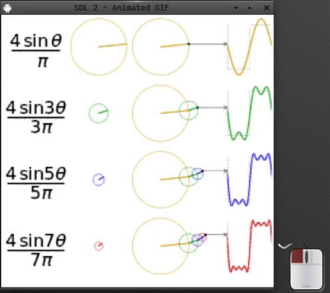

### GIF Animation  

This is a small SDL2 Demo and it does demonstrate how to...  

  * replay an animated gif
  * scales the picture
  * animation is pauseable

Useful links:  
[SDL2](https://www.libsdl.org/) [SDL-Discourse](https://discourse.libsdl.org) [More SDL2 Example Code](https://acry.github.io/)

Assets:  
sine.gif - [wikipedia](https://upload.wikimedia.org/wikipedia/commons/1/1a/Fourier_series_square_wave_circles_animation.gif)  
c-exec.gif [HowStuffWorks](https://computer.howstuffworks.com/c.htm)  
[Font Awesome](https://fontawesome.com/)  

[Get in touch on SDL-Discourse](https://discourse.libsdl.org/u/Acry/summary)  

#### Details:  
Using [SDL_gifwrap](https://github.com/grimfang4/SDL_gifwrap)  
by Jonathan Dearborn.  
after clone use:  
`git submodule update --init --recursive`  
in the repo's dir.  

...see the rest in the source.
